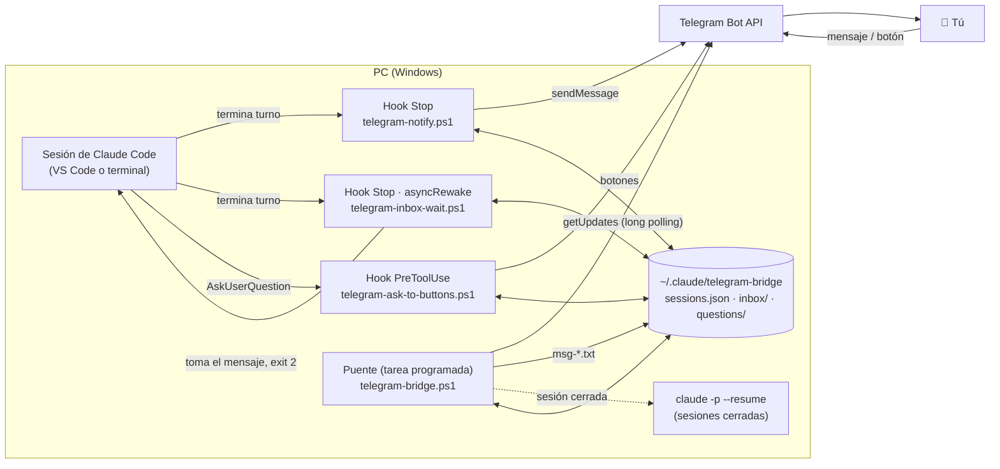

# claude-code-telegram-bridge

**Controla tus sesiones de [Claude Code](https://code.claude.com) desde Telegram: recibe avisos cuando terminan, respóndeles desde el celular y contesta sus preguntas con botones, sin cerrar la sesión abierta en VS Code.**


> **English summary:** A Windows bridge between a Telegram bot and Claude Code. Built entirely on Claude Code hooks plus a small PowerShell daemon, it notifies you when a session finishes, lets you reply from your phone and have the message processed *inside the already-open VS Code session* (via an `asyncRewake` hook that wakes idle sessions), falls back to `claude -p --resume` for closed sessions, queues messages for busy sessions, and turns Claude's multiple-choice questions into Telegram inline buttons. No servers, no public endpoints: everything runs locally using long polling.

---

## Índice

- [Qué hace](#qué-hace)
- [Cómo se ve](#cómo-se-ve)
- [Cómo funciona](#cómo-funciona)
- [Requisitos](#requisitos)
- [Instalación rápida](#instalación-rápida)
- [Uso](#uso)
- [Configuración](#configuración)
- [Seguridad](#seguridad)
- [Limitaciones conocidas](#limitaciones-conocidas)
- [Estructura del proyecto](#estructura-del-proyecto)
- [Aspectos técnicos destacados](#aspectos-técnicos-destacados)
- [Documentación](#documentación)
- [Licencia](#licencia)

---

## Qué hace

| Función | Descripción |
|---|---|
| 🔔 **Avisos** | Cuando una sesión de Claude Code termina un turno o pide aprobación, te llega un mensaje con la respuesta (en Markdown convertido a HTML de Telegram). |
| 🎨 **Una identidad por sesión** | Cada sesión lleva un cuadrado de color (🟦🟩🟧…), el nombre del proyecto y un tag `#s_xxxxxx`. Así distingues de un vistazo qué sesión te habla. |
| ↩️ **Responder desde el celular** | Responde a un aviso, toca **↩️ Responder** (te escribe `/s <id>` en la caja de texto) o usa `/s id mensaje`. |
| 🖥️ **Entrega en vivo** | Si la sesión está abierta en VS Code, tu mensaje la **despierta** y se procesa ahí mismo, a la vista. No hay que cerrarla ni reabrirla. |
| 🌙 **Sesiones cerradas** | Si la sesión no está abierta, el mensaje se ejecuta en segundo plano con `claude -p --resume`, en la carpeta del proyecto. |
| 🕒 **Cola** | Si la sesión está trabajando, tu mensaje espera y se entrega cuando termine. |
| 🔘 **Decisiones con botones** | Cuando Claude te hace una pregunta con opciones en un turno pedido desde Telegram, te llega con botones (selección simple o múltiple, o respuesta libre). |
| 📄 **Respuestas largas** | Se parten en varias partes encadenadas ("parte 2/3 · continuación"), sin cortar bloques de código. |
| 🟢 **Salud** | El puente avisa cuando vuelve a estar activo, y si se cae, el siguiente aviso lo indica e intenta reiniciarlo. |

## Cómo se ve

> Agrega aquí tus capturas (ver [docs/img/README.md](docs/img/README.md) para la lista sugerida).

| Aviso con color de sesión y botón Responder | Pregunta con botones | Mensaje entregado en VS Code |
|---|---|---|
|  |  |  |

## Cómo funciona



1. **Avisos.** Al terminar cada turno, el hook `Stop` lee la última respuesta del transcript, la convierte a HTML de Telegram y la manda por el bot con el color, el proyecto y el tag de la sesión. También registra la sesión (id, carpeta, estado) en `sessions.json`.
2. **Escucha.** Un segundo hook `Stop`, configurado con `asyncRewake`, queda corriendo en segundo plano y vigila el buzón de su sesión (`inbox/<session_id>/`).
3. **Puente.** Un script de PowerShell (tarea programada al iniciar sesión) lee el bot con *long polling*. Solo atiende al usuario autorizado. Resuelve a qué sesión va cada mensaje y:
   - si la sesión está **abierta y escuchando**, deja el mensaje en su buzón. El hook lo toma con un *rename* atómico, lo imprime y sale con código 2: Claude Code **despierta la sesión aunque esté inactiva** y Claude lo procesa ahí mismo;
   - si **nadie lo toma** en 20 s (sesión cerrada), lo recupera y ejecuta `claude -p --resume <id>` en la carpeta del proyecto;
   - si la sesión está **ocupada**, lo encola hasta que el hook `Stop` la marque libre.
4. **Preguntas.** En turnos pedidos desde Telegram, un hook `PreToolUse` intercepta `AskUserQuestion`, manda las preguntas con botones y bloquea el diálogo de la PC. Cuando contestas todas, el puente las entrega a la sesión como un mensaje más.
5. **Permisos.** En esos mismos turnos remotos, un hook `PermissionRequest` aplica el modo configurado (por ejemplo, aprobar automáticamente), porque nadie está frente a la PC para responder el diálogo.

Más detalle (formatos de archivos, secuencias, decisiones de diseño) en [docs/ARCHITECTURE.md](docs/ARCHITECTURE.md).

## Requisitos

- **Windows 10/11** con **Windows PowerShell 5.1** (viene instalado).
- **Claude Code** con soporte de hooks `asyncRewake` (extensión de VS Code o CLI recientes). La CLI `claude` en el PATH hace falta para las sesiones cerradas.
- **Un bot de Telegram dedicado**, creado con [@BotFather](https://t.me/BotFather) y **sin webhook**.
- `curl.exe` (incluido en Windows 10+), solo para subir la foto del bot.

## Instalación rápida

```powershell
git clone https://github.com/<tu-usuario>/claude-code-telegram-bridge.git
cd claude-code-telegram-bridge
powershell -ExecutionPolicy Bypass -File .\install.ps1
```

El instalador te pide el token del bot y detecta tu ID cuando le mandas `/start` al bot. Después te pregunta el modo de permisos, copia los archivos, registra los hooks en `~/.claude/settings.json` (con respaldo previo), configura el perfil del bot y crea la tarea programada. Al final recibes un mensaje de prueba.

👉 Guía paso a paso, instalación manual y verificación: **[docs/INSTALL.md](docs/INSTALL.md)**.

Para desinstalar: `powershell -ExecutionPolicy Bypass -File .\uninstall.ps1` (agrega `-Purge` para borrar también la config y los logs).

## Uso

| En Telegram | Qué hace |
|---|---|
| **Responder** a un aviso | Manda tu texto a la sesión del aviso. |
| Botón **↩️ Responder** | Escribe `@bot /s <id> ` en la caja de texto; completa y envía. |
| `/s id mensaje` | Envía a la sesión `id` (las letras después de `#s_`; con 3 o más basta si no hay ambigüedad). |
| `/sesiones` | Lista las sesiones recientes con su color y estado (🟢 abierta, 🔄 trabajando, ⚪ cerrada, cola). |
| `/parar id` | Retira lo que mandaste a esa sesión y aún no se ejecutó, o detiene la ejecución en segundo plano. |
| `/forzar id` | Marca como libre una sesión que quedó "ocupada" (por ejemplo, tras un turno interrumpido) y suelta su cola. |
| `/ayuda` | Ayuda. |

En VS Code, los mensajes que llegan desde Telegram aparecen como un aviso del hook ("📱 Mensaje del usuario enviado desde Telegram"), y la respuesta de Claude empieza citando tu mensaje para que quede visible en el chat.

## Configuración

`~/.claude/telegram-bridge/config.json` (lo crea el instalador; plantilla en [config.example.json](config.example.json)):

| Campo | Descripción |
|---|---|
| `botToken` | Token del bot (BotFather). |
| `allowedUserId` | Tu ID de Telegram: es el único usuario al que el puente obedece. |
| `chatId` | Chat al que se mandan los avisos (tu ID, para un chat privado). |
| `permissionMode` | Modo de permisos para lo que se ejecute desde Telegram: `acceptEdits`, `bypassPermissions` o `default`. |
| `maxMessageAgeMinutes` | Los mensajes más viejos que esto no se ejecutan (por ejemplo, si la PC estaba apagada). Las consultas como `/sesiones` sí se responden. |
| `busyStaleMinutes` | Tras este tiempo, una sesión marcada como ocupada se considera libre. |
| `fallbackNotifyUrl` | Opcional: endpoint HTTP alternativo (`POST message`, `parse_mode`) si el bot no responde. |

## Seguridad

- **Solo obedece a un usuario** (`allowedUserId`, verificado con el `from.id` que firma Telegram) y solo en chats privados.
- **No expone nada a internet:** usa *long polling* (`getUpdates`), no webhooks ni puertos abiertos.
- **El token vive solo en `config.json`**, que está en `.gitignore`. Si se filtra, revócalo con `/revoke` en BotFather.
- **Modo de permisos:** con `bypassPermissions`, quien acceda a tu cuenta de Telegram puede ejecutar cualquier cosa en tu PC. El valor recomendado es `acceptEdits`. Activa la verificación en dos pasos de Telegram.
- Los mensajes con más de `maxMessageAgeMinutes` no se ejecutan, para evitar órdenes viejas al encender la PC.
- La aprobación automática solo aplica a turnos pedidos desde Telegram. La marca se borra al terminar el turno y caduca a la hora, y lo que escribes en VS Code pide aprobación como siempre.

## Limitaciones conocidas

- **Windows únicamente** (PowerShell 5.1, Programador de tareas, Win32_Process).
- Una sesión empieza a escuchar **después de su primer turno**: Claude Code no permite hooks en segundo plano en `SessionStart`.
- En VS Code tu mensaje no aparece como "burbuja" de usuario, sino como aviso del hook. Por eso se pide a Claude que lo cite.
- Un turno que se está procesando en la sesión abierta solo se interrumpe desde la PC (Esc).
- Si la sesión se procesó en segundo plano (`claude -p`), la ventana de VS Code ya abierta no muestra esos turnos hasta que reabras la sesión.

## Estructura del proyecto

```
claude-code-telegram-bridge/
├── install.ps1                     # Instalador interactivo (idempotente)
├── uninstall.ps1                   # Desinstalador (-Purge borra config y logs)
├── config.example.json             # Plantilla de configuración
├── hooks/                          # Se copian a ~/.claude/hooks
│   ├── telegram-bridge-lib.ps1     # Librería común: Bot API, registro de sesiones, buzones, colores
│   ├── telegram-notify.ps1         # Stop: aviso de fin de turno (partes, color, botón Responder)
│   ├── telegram-inbox-wait.ps1     # Stop (asyncRewake): escucha el buzón y despierta la sesión
│   ├── telegram-notify-permission.ps1  # Notification: aviso de aprobación pendiente
│   ├── telegram-session-state.ps1  # UserPromptSubmit / SessionEnd: sesión ocupada / libre
│   ├── telegram-permission-auto.ps1    # PermissionRequest: permisos en turnos remotos
│   └── telegram-ask-to-buttons.ps1 # PreToolUse(AskUserQuestion): preguntas con botones
├── bridge/                         # Se copian a ~/.claude/telegram-bridge
│   ├── telegram-bridge.ps1         # Puente: long polling, cola, entrega en vivo / en segundo plano
│   ├── setup-bot.ps1               # Descripción, comandos y foto del bot
│   └── install-bridge.ps1          # Tarea programada "Claude Telegram Bridge"
├── assets/avatar.jpg               # Foto del bot
├── tools/make-avatar.ps1           # Genera el avatar con System.Drawing
└── docs/                           # Instalación, arquitectura, solución de problemas
```

## Aspectos técnicos destacados

- **Integración orientada a eventos** con siete hooks de Claude Code (`Stop`, `Notification`, `UserPromptSubmit`, `SessionEnd`, `PermissionRequest`, `PreToolUse`), incluido un hook `asyncRewake` que despierta sesiones inactivas.
- **IPC por sistema de archivos sin condiciones de carrera.** El mensaje se entrega con un *rename* atómico de NTFS (`msg-*.txt` → `.taken` o `.cancelled`): o lo toma la sesión o lo recupera el puente, nunca los dos. El registro compartido se protege con un mutex con nombre.
- **Detección de vida.** Un *heartbeat* por buzón y del puente, y monitoreo del proceso `claude.exe` dueño de cada sesión, con limpieza automática si se cierra.
- **Tolerancia a fallos.** Respaldo con `claude -p --resume` si la sesión no responde en 20 s, cola con detección de sesiones trabadas, descarte de mensajes viejos y reinicio automático del puente por el Programador de tareas y por los propios hooks.
- **Bot API sin dependencias.** Long polling, teclados inline, `callback_query`, edición de mensajes, `switch_inline_query_current_chat`, subida *multipart* de la foto de perfil, partición de respuestas largas respetando bloques de código y conversión de Markdown a HTML de Telegram.
- **Detalles de Windows PowerShell 5.1** resueltos a mano: UTF-8 de extremo a extremo (las respuestas HTTP se decodifican con `StreamReader` porque `Invoke-RestMethod` usa Latin-1, y los scripts se guardan con BOM), procesos sin ventana vía `cmd /c` con redirecciones y paso de argumentos a ejecutables nativos.

## Documentación

- [docs/INSTALL.md](docs/INSTALL.md): instalación paso a paso, manual y verificación.
- [docs/ARCHITECTURE.md](docs/ARCHITECTURE.md): componentes, flujos, formatos de archivo y decisiones de diseño.
- [docs/TROUBLESHOOTING.md](docs/TROUBLESHOOTING.md): problemas comunes y cómo diagnosticarlos.

## Licencia

[MIT](LICENSE) © 2026 DNMjustMe
