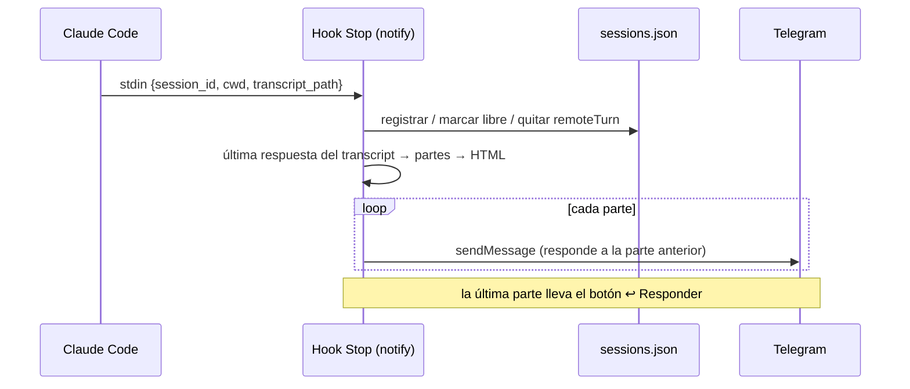
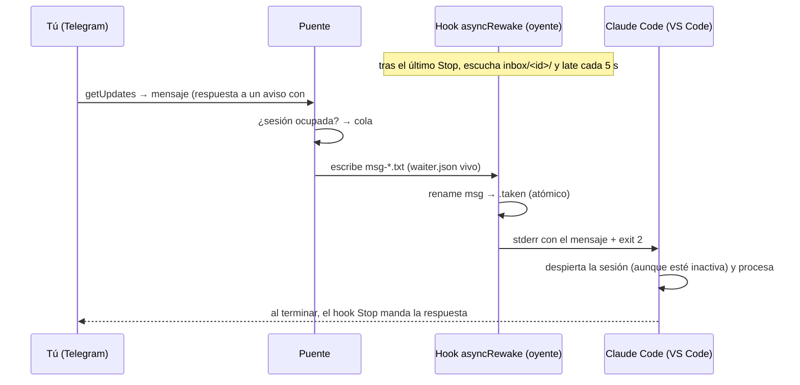
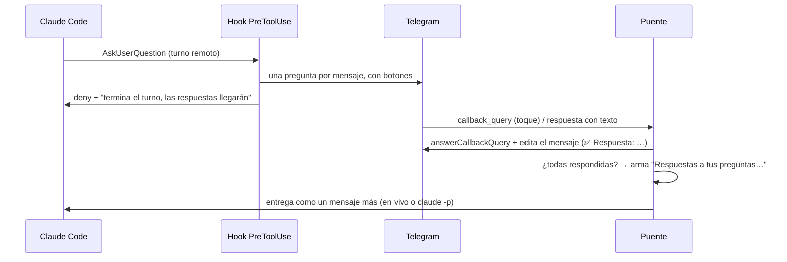

# Arquitectura

## Componentes

| Componente | Tipo | Responsabilidad |
|---|---|---|
| `telegram-bridge-lib.ps1` | Librería (dot-sourcing) | Llamadas a la Bot API en UTF-8, envío con respaldo, registro de sesiones con mutex, buzones, colores, lotes de preguntas, heartbeat. |
| `telegram-notify.ps1` | Hook `Stop` | Lee la última respuesta del transcript, la convierte a HTML de Telegram, la parte si es larga y la envía. Marca la sesión libre. |
| `telegram-inbox-wait.ps1` | Hook `Stop` con `asyncRewake` | Escucha el buzón de la sesión. Al recibir un mensaje lo imprime en stderr y sale con código 2, y Claude Code despierta la sesión. |
| `telegram-notify-permission.ps1` | Hook `Notification` | Aviso de aprobación pendiente, con el detalle de la herramienta. |
| `telegram-session-state.ps1` | Hooks `UserPromptSubmit` / `SessionEnd` | Marca la sesión ocupada o libre. Quita la marca de turno remoto y retira el oyente al cerrar. |
| `telegram-permission-auto.ps1` | Hook `PermissionRequest` | En turnos remotos aplica `permissionMode` (aprueba si es `bypassPermissions`). |
| `telegram-ask-to-buttons.ps1` | Hook `PreToolUse` (`AskUserQuestion`) | En turnos remotos convierte las preguntas en botones y bloquea el diálogo. |
| `telegram-bridge.ps1` | Proceso residente (tarea programada) | Long polling, autorización, comandos, cola, entrega en vivo o por `claude -p`, botones, heartbeat. |

## Estado en disco (`~/.claude/telegram-bridge/`)

| Archivo | Contenido |
|---|---|
| `config.json` | Token, usuario autorizado, modo de permisos, tiempos. |
| `sessions.json` | Registro de sesiones (ver abajo). Lo escriben hooks y puente, protegido por el mutex `Local\ClaudeTelegramBridgeRegistry`. |
| `inbox/<session_id>/waiter.json` | Oyente activo: `{ guid, pid, claudePid, heartbeat }`. |
| `inbox/<session_id>/msg-<timestamp>.txt` | Mensaje pendiente de entrega. Pasa a `.taken` (lo tomó la sesión) o `.cancelled` (lo recuperó el puente). |
| `questions/<batchId>.json` | Lote de preguntas con botones (ver abajo). |
| `jobs/<fecha>_<id>/` | `prompt.txt`, `out.txt` y `err.txt` de cada ejecución con `claude -p`. Se borran a los 7 días. |
| `offset.txt` | Último `update_id` procesado de Telegram. |
| `heartbeat.txt` | Último latido del puente (ISO-8601). |
| `bridge.log` | Log del puente (rota a 1 MB). |

`sessions.json`:

```json
[
  {
    "short": "6279b4",
    "sessionId": "6279b4a5-9bfb-43ab-aa50-d768e7ff7174",
    "cwd": "C:\\proyectos\\mi-api",
    "project": "mi-api",
    "lastSeen": "2026-10-07T10:31:22.000-04:00",
    "busy": false,
    "busySince": null,
    "remoteTurn": false,
    "remoteTurnSince": null,
    "color": "🟩"
  }
]
```

`questions/<batchId>.json`:

```json
{
  "batchId": "d4032bf0",
  "sessionId": "6279b4a5-...",
  "project": "mi-api",
  "created": "2026-10-07T10:20:00.000-04:00",
  "questions": [
    {
      "question": "¿Qué base de datos usamos?",
      "header": "Base de datos",
      "multiSelect": false,
      "options": ["PostgreSQL", "MySQL"],
      "html": "…texto del mensaje en Telegram…",
      "messageId": 120,
      "selected": ["PostgreSQL"],
      "done": true
    }
  ]
}
```

## Flujos

### Aviso de fin de turno



### Mensaje a una sesión abierta (entrega en vivo)



Si en 20 s el mensaje sigue como `msg-*.txt`, el puente lo renombra a `.cancelled` y lo ejecuta con `claude -p --resume <id> --permission-mode <modo>` en la carpeta de la sesión. El *rename* es atómico en NTFS, así que el mensaje se ejecuta exactamente una vez.

### Preguntas con botones



## Decisiones de diseño

- **Hooks en vez de MCP/Channels.** Los *channels* de Claude Code solo se activan al lanzar la CLI con `--channels`, no en una sesión ya abierta de VS Code. Los hooks funcionan en cualquier sesión, y `asyncRewake` es el único mecanismo documentado que despierta una sesión inactiva desde fuera.
- **Long polling en vez de webhook.** No hace falta servidor público, certificado ni puertos abiertos.
- **Archivos + rename atómico como IPC.** Es simple y depurable (puedes ver el buzón con el Explorador), sobrevive a reinicios del puente y garantiza una sola entrega sin coordinar procesos.
- **Un oyente por sesión.** Cada `Stop` arranca un oyente nuevo, que reemplaza al anterior mediante el `guid` de `waiter.json`. El oyente vigila el `claude.exe` dueño de su sesión y se retira si este muere.
- **`remoteTurn` acotado.** La aprobación automática solo aplica mientras dura un turno pedido desde Telegram. `Stop` y `UserPromptSubmit` borran la marca, y caduca sola a la hora por si un turno se interrumpe.
- **Mensajes viejos no se ejecutan.** Telegram guarda los mensajes hasta 24 h, y al encender la PC no conviene ejecutar órdenes de anoche.
- **Windows PowerShell 5.1 sin dependencias.** Viene con Windows y no requiere instalar Node, Python ni módulos.
